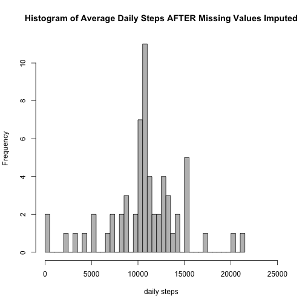

## Loading and preprocessing the data

#### Load the Data

Read in the data from the file 'activity.csv'.


```r
#read the data in directly from a .csv file
inData <- read.csv("activity.csv")
```

## What is mean total number of steps taken per day?

#### Calculate the total number of steps taken per day

Compute the daily count of total number of steps taken, ignoring NA values. 

Split the step data into subsets by the date and sum the steps taken each day.


```r
#we will need to process the data slightly to make the computations easier
dailySteps <- aggregate(inData$steps,list(inData$date),FUN=sum,na.rm=TRUE)
library(ggplot2)
```

#### Calcluate and report the mean and median of the total number of steps taken per day.

Compute the mean and median values of the daily step count and create the histogram plot of the data.


```r
#compute the mean and median values
meanDailySteps = mean(dailySteps$x)
medianDailySteps = median(dailySteps$x)
hist(dailySteps$x,breaks=50,freq=TRUE,col="gray",main="Histogram of Average Daily Steps",xlab="daily steps",xlim=c(0,25000))
```

 

- Mean number of steps taken each day = 9354.23
- Median number of steps taken each day = 10395

## What is the average daily activity pattern?

#### Make a time series plot of the 5-minute interval and the average number of steps taken, averaged across all days.

Split the data by steps taken per each 5 minute interval and average the interval steps over all days. 

Create a times series plot of the data.


```r
#process the data slightly before processing/creating the histogram; plot the data; and add some annotations
intSteps <- aggregate(inData$steps,list(inData$interval),FUN=mean,na.rm=TRUE)
plot(intSteps,type='l',col='dark red',xlab='5-minute interval',ylab='average steps taken',xlim=c(0,2400), ylim=c(-15,250), main="Average Steps by Time of Day", lwd=c(2), sub="(time of day is above x-axis)")
text(0,-12,"00:00")
text(600,-12,"06:00")
text(1200,-12,"12:00")
text(1800,-12,"18:00")
text(2400,-12,"24:00")
```

 

#### Which 5-minute interval, on average across all the days in the dataset, contains the maximum number of steps?

Determine the interval which has the maximum number of steps (on average) over all dates.


```r
#compute the 5 minute interval with the max steps, on average
maxInterval <- intSteps$Group.1[[which.max(intSteps$x)]]
```

- Time of maximum steps taken in a five minute interval (on average) = 835


## Imputing missing values

#### Calculate and report the total number of missing values in the dataset.

Determine the number of missing entries (number of 5-minutes intervals which have NA reported as the number of steps).


```r
#count the number of step entries that are NA
missingSteps <- sum(is.na(inData$steps))
```


- Number of missing entries = 2304

#### Devise a strategy for filling in missing values in the dataset. Create a new dataset that is equal to the original dataset but with the missing data filled in.

For this case, we will use the mean over the 5-minute interval to fill data holes.


```r
#impute the data by filling holes with the average number of steps in that 5-minute period
naValsPos <- which(is.na(inData$steps))
numNA <- length(naValsPos)
for (i in 1:numNA){
  missLoc <- inData$interval[[naValsPos[i]]]
  inData$steps[[naValsPos[i]]] <- intSteps$x[which(intSteps$Group.1==missLoc)]
}
```

#### Make a histogram of the total number of steps taken each day and calculate and report the mean and median total number of steps taken per day. 


```r
#process the data slightly; compute mean and median; plot the data; and add some annotations
dailySteps <- aggregate(inData$steps,list(inData$date),FUN=sum)
meanDailySteps = mean(dailySteps$x)
medianDailySteps = median(dailySteps$x)
hist(dailySteps$x,breaks=50,freq=TRUE,col="gray",main="Histogram of Average Daily Steps AFTER Missing Values Imputed",xlab="daily steps",xlim=c(0,25000))
```

 

- Mean number of steps taken each day = 10766.2
- Median number of steps taken each day = 10766.2


#### Do these values differ from the estimates from the first part of the assignment? 

Yes, there is a difference.

#### What is the impact of imputing missing data on the estimates of the total daily number of steps?

By replacing missing values with the average report for that interval, we are adding many more steps to the data. This will necessarily increase the mean.

## Are there differences in activity patterns between weekdays and weekends?

#### Create a new factor variable in the dataset with two levels – “weekday” and “weekend” indicating whether a given date is a weekday or weekend day.


```r
#process the data to extract the weekend step data
weekDaySteps <- inData$steps[weekdays(as.POSIXlt(inData$date))!="Sunday" && weekdays(as.POSIXlt(inData$date))!="Saturday"]
weekDayInts <- inData$interval[weekdays(as.POSIXlt(inData$date))!="Sunday" && weekdays(as.POSIXlt(inData$date))!="Saturday"]
weekDayIntSteps <- aggregate(weekDaySteps,list(weekDayInts),FUN=mean,na.rm=TRUE)

#process the data to extract the weekday step data
weekEndSteps <- inData$steps[weekdays(as.POSIXlt(inData$date))=="Sunday" | weekdays(as.POSIXlt(inData$date))=="Saturday"]
weekEndInts <- inData$interval[weekdays(as.POSIXlt(inData$date))=="Sunday" | weekdays(as.POSIXlt(inData$date))=="Saturday"]
weekEndIntSteps <- aggregate(weekEndSteps,list(weekEndInts),FUN=mean,na.rm=TRUE)
```

#### Make a panel plot containing a time series plot of the 5-minute interval (x-axis) and the average number of steps taken, averaged across all weekday days or weekend days (y-axis).


```r
#plot the data and add annotations as needed
nf <- layout(matrix(c(1,2),2,1))
par(mar=c(5,5,1,0))
plot(weekDayIntSteps$Group.1,weekDayIntSteps$x,type='l',col='dark red',xlab='5-minute interval',ylab='average steps taken',xlim=c(0,2400), ylim=c(-30,250), lwd=c(2))
text(1200,230,"Average WEEKDAY Steps by 5-Minute Interval")
text(0,-20,"00:00")
text(600,-20,"06:00")
text(1200,-20,"12:00")
text(1800,-20,"18:00")
text(2400,-20,"24:00")

par(mar=c(5,5,1,0))
plot(weekEndIntSteps$Group.1,weekEndIntSteps$x,type='l',col='dark red',xlab='5-minute interval',ylab='average steps taken',xlim=c(0,2400), ylim=c(-30,250), lwd=c(2), sub="(time of day is above x-axis)")
text(1200,230,"Average WEEKEND Steps by 5-Minute Interval")
text(0,-20,"00:00")
text(600,-20,"06:00")
text(1200,-20,"12:00")
text(1800,-20,"18:00")
text(2400,-20,"24:00")
```

 


There are differences between weekend and weekday plots. Clearly more steps are taken on weekdays in the middle of the day than on weekends.
